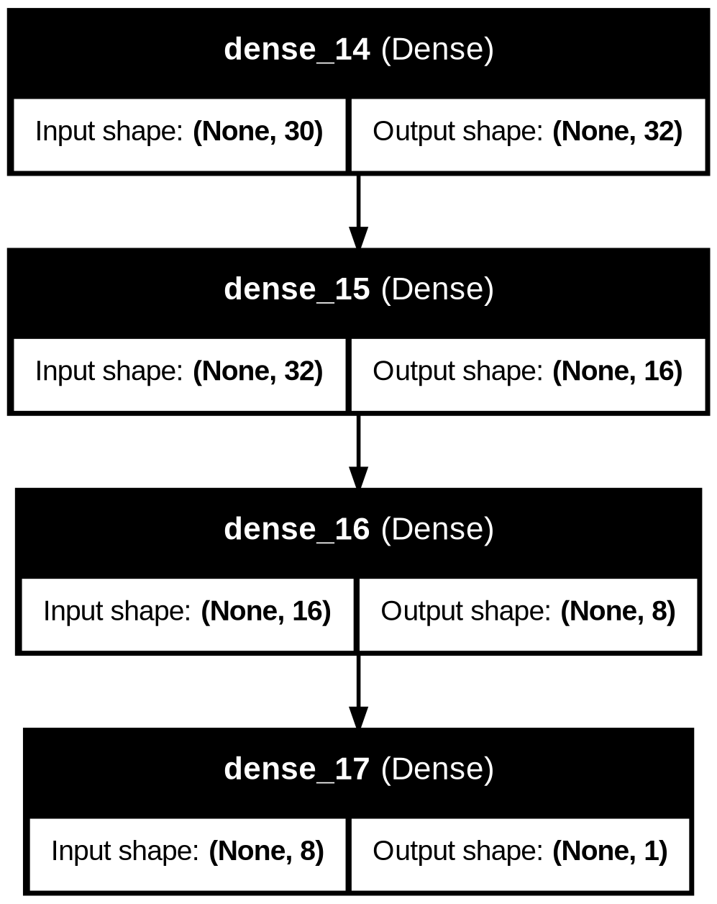
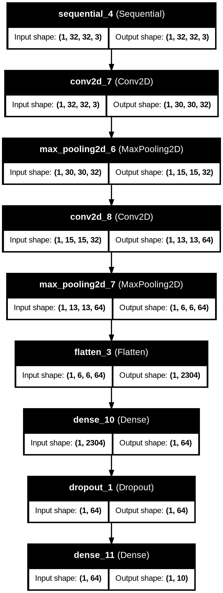

# Deep Learning Experiments

This repository contains my Artificial Intelligence & Machine Learning Task 6, focused on **Deep Learning Fundamentals and Neural Network Implementation**.

The project covers Artificial Neural Networks (ANN), Convolutional Neural Networks (CNN), regularization, data augmentation, transfer learning, model evaluation, and comparison of different machine learning and deep learning approaches.

## 🚀 Live Streamlit Application

The project is deployed using Streamlit:

👉 **[Open the Live Streamlit App](https://deep-learning-experiments-wsublomqw2bxvuwmsnbou7.streamlit.app/)**

The application provides an interactive way to explore the deep learning experiments and model results.

---

## 📌 Project Objectives

The main objectives of this project are:

- Understand the fundamentals of Deep Learning.
- Understand the structure of Artificial Neural Networks.
- Implement an ANN using TensorFlow and Keras.
- Understand forward propagation and backpropagation.
- Train and evaluate neural network models.
- Understand CNN architecture for image classification.
- Implement a CNN using the CIFAR-10 dataset.
- Experiment with Dropout regularization.
- Apply data augmentation.
- Implement transfer learning using MobileNetV2.
- Compare traditional Machine Learning, ANN, CNN, and Transfer Learning models.
- Visualize model architecture and performance.

---

# 🧠 1. Artificial Neural Network (ANN)

For the ANN experiment, the **Breast Cancer Wisconsin dataset** available through Scikit-learn was used.

### Dataset

- Samples: 569
- Features: 30
- Target: Binary classification
- Classes:
  - Malignant
  - Benign

### ANN Architecture

The neural network consists of:

- Input layer
- Dense layer with 32 neurons and ReLU activation
- Dense layer with 16 neurons and ReLU activation
- Dense layer with 8 neurons and ReLU activation
- Output layer with 1 neuron and Sigmoid activation

### Training

- Optimizer: Adam
- Loss function: Binary Crossentropy
- Epochs: 50
- Batch size: 32
- Validation split: 20%
- Feature scaling: StandardScaler

### ANN Performance

The ANN achieved an accuracy of approximately:

**95.61%**

---

# 🖼️ 2. Convolutional Neural Network (CNN)

For image classification, the **CIFAR-10 dataset** was used.

CIFAR-10 contains 10 image classes:

1. Airplane
2. Automobile
3. Bird
4. Cat
5. Deer
6. Dog
7. Frog
8. Horse
9. Ship
10. Truck

The images were normalized by scaling pixel values between 0 and 1.

---

## Basic CNN

The basic CNN consists of:

- Convolutional layer
- Max Pooling layer
- Convolutional layer
- Max Pooling layer
- Flatten layer
- Dense layer
- Output layer with Softmax activation

### Basic CNN Accuracy

**68.89%**

---

# 🛡️ 3. CNN with Dropout

Dropout regularization was introduced to reduce overfitting.

A Dropout layer with a rate of 0.5 was added before the output layer.

### CNN + Dropout Accuracy

**65.66%**

---

# 🔄 4. CNN with Data Augmentation

Data augmentation was applied using:

- Random horizontal flipping
- Random rotation
- Random zoom

Dropout regularization was also used.

### CNN + Augmentation + Dropout Accuracy

**59.37%**

---

# 🌐 5. Transfer Learning

Transfer learning was implemented using **MobileNetV2** with ImageNet pretrained weights.

The pretrained convolutional base was frozen and additional classification layers were added for CIFAR-10 classification.

### Transfer Learning Accuracy

**77.20%**

---

# 📊 Model Comparison

The following table shows the final accuracy results obtained during the experiments.

| Model | Accuracy |
|---|---:|
| Logistic Regression | 98.25% |
| ANN | 95.61% |
| Basic CNN | 68.89% |
| CNN + Dropout | 65.66% |
| CNN + Augmentation + Dropout | 59.37% |
| Transfer Learning | 77.20% |

> Note: The models were trained under different experimental settings and datasets, so the accuracy values should be interpreted in the context of their respective experiments rather than as a direct benchmark on one identical dataset.

---

# 📈 Final CNN Classification Results

The final CNN experiment produced the following classification performance on CIFAR-10:

| Class | Precision | Recall | F1-Score |
|---|---:|---:|---:|
| Airplane | 0.66 | 0.62 | 0.64 |
| Automobile | 0.62 | 0.82 | 0.71 |
| Bird | 0.60 | 0.33 | 0.43 |
| Cat | 0.47 | 0.39 | 0.43 |
| Deer | 0.66 | 0.35 | 0.45 |
| Dog | 0.63 | 0.41 | 0.50 |
| Frog | 0.60 | 0.76 | 0.67 |
| Horse | 0.56 | 0.72 | 0.63 |
| Ship | 0.64 | 0.80 | 0.71 |
| Truck | 0.54 | 0.75 | 0.63 |

### Overall CNN Metrics

- Accuracy: **59.37%**
- Precision: **59.78%**
- Recall: **59.37%**
- F1-Score: **57.85%**

---

# 🏗️ Project Architecture

## ANN



## CNN



---

# 🛠️ Technologies Used

- Python
- TensorFlow
- Keras
- Scikit-learn
- NumPy
- Pandas
- Matplotlib
- Streamlit
- MobileNetV2
- CIFAR-10
- Jupyter Notebook / Google Colab

---

# 📂 Repository Structure

```text
Deep-Learning-Experiments/
│
├── app.py
├── Deep_Learning_Task_6.ipynb
│
├── ann_architecture.png
├── cnn_architecture.png
│
├── ann_breast_cancer_model.keras
├── final_cnn_model.keras
├── transfer_learning_model.keras
│
├── final_model_comparison.csv
├── requirements.txt
│
└── README.md